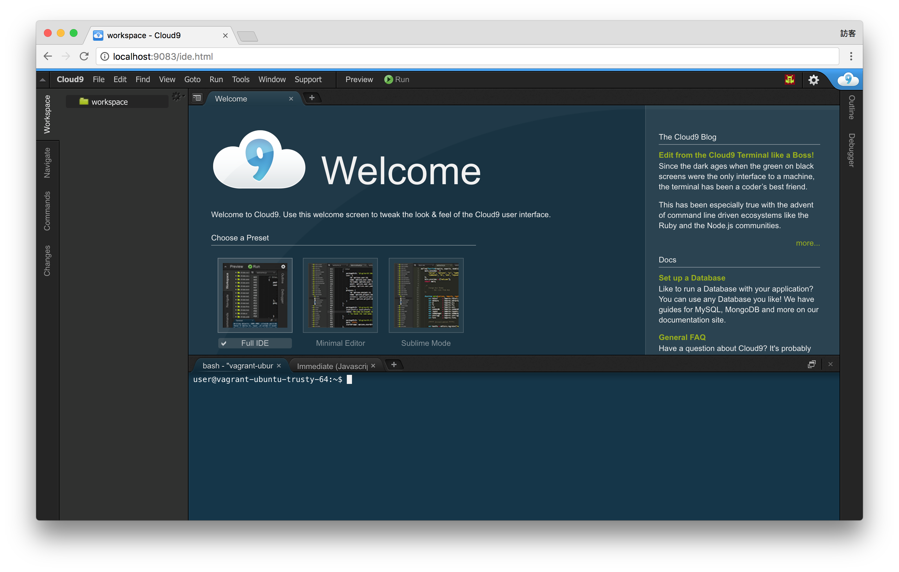

# 匯入 ova

## 目錄
- [回目錄](../SUMMARY.md)

***

## 安裝步驟

1. 下載 ova 檔案    
  - 載點1 [HelloJS NAS](http://gofile.me/3sM7m/TTuD1o2Aj)
  - 載點2 [Google Drive](https://drive.google.com/file/d/0B-XkApzKpJ7QVlJCaXJmdGhiZEk/view?usp=sharing)
  - 載點3 [MEGA](https://mega.nz/#!c19wXIwJ!_20jF5ehdNUsRc-3yEnEBi9XVqCC9fD8T_R31Rb66t0)
  - 跟工作人員拿安裝隨身碟
2.  雙擊 ova 並開啟檔案   

3. 開啟 VirtualBox 管理員，並點擊匯入

4. 匯入中請稍候

5. 虛擬機開啟完成

6. 打開瀏覽器
[http://localhost:9083/](http://localhost:9083/)

