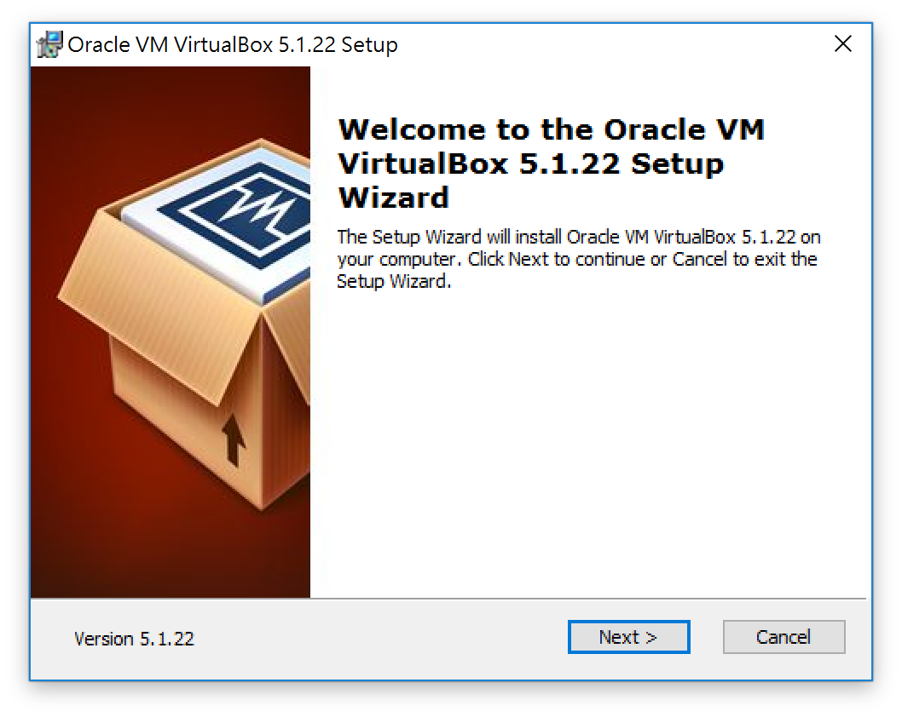
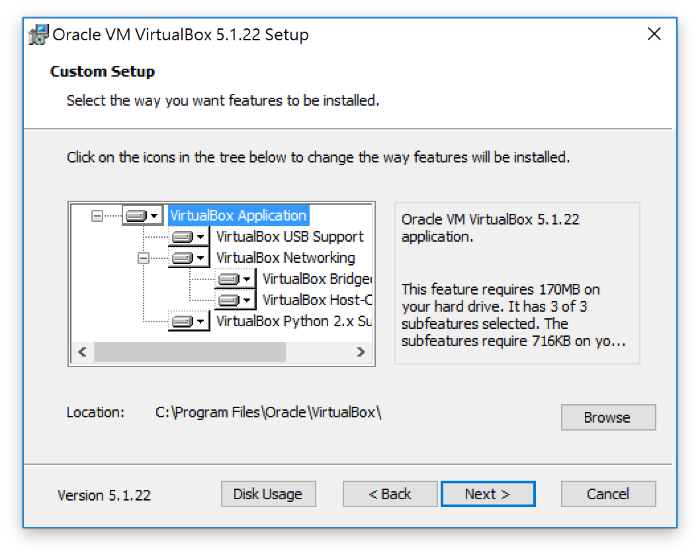
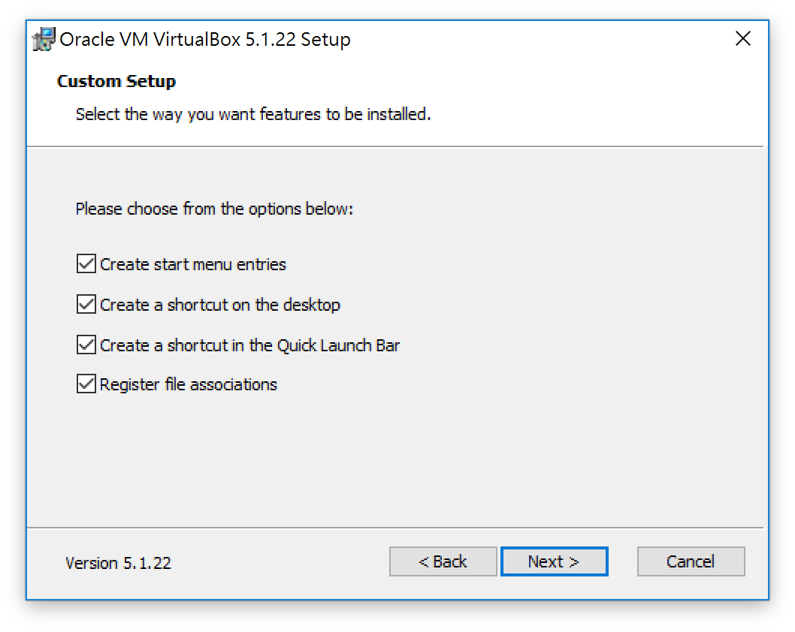
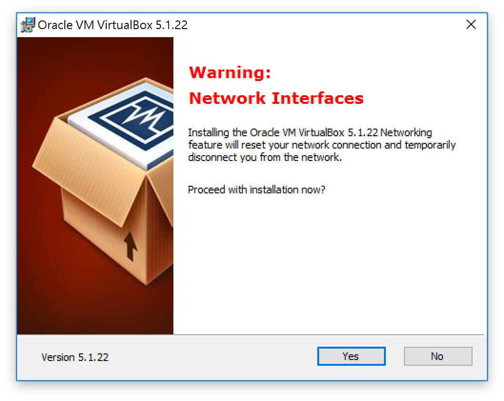
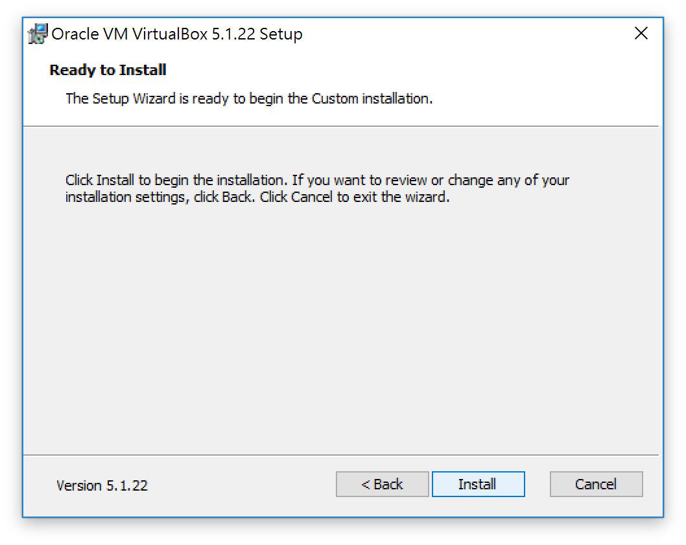
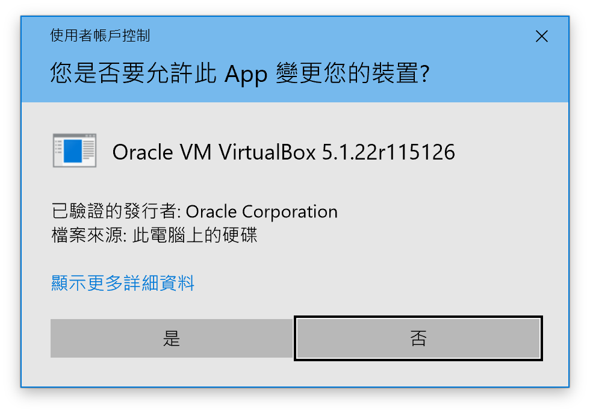
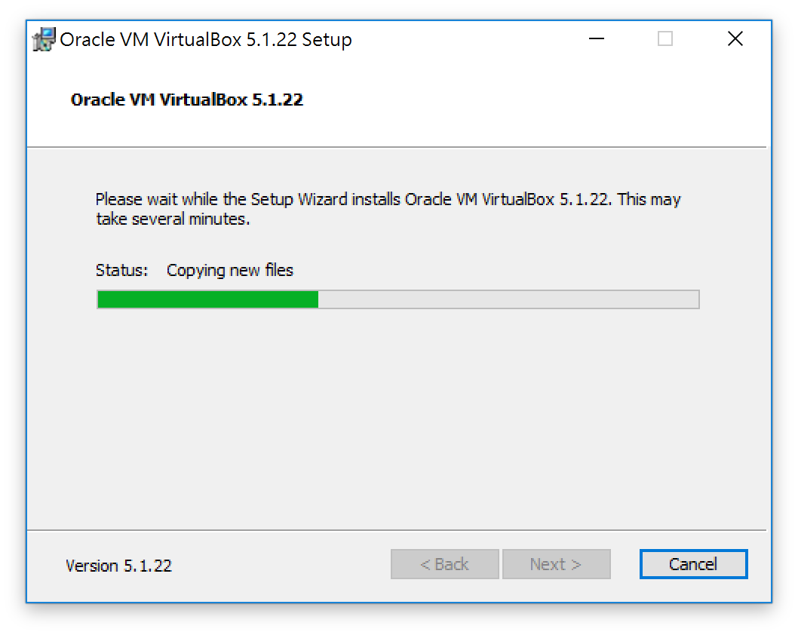
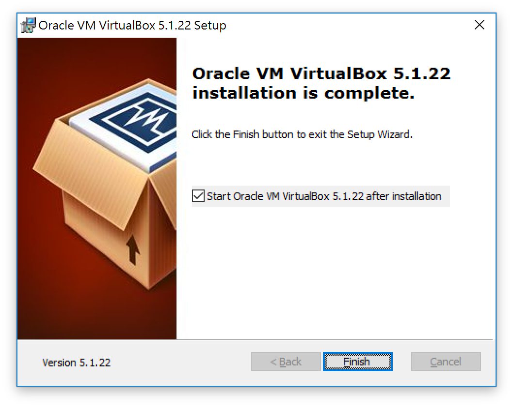
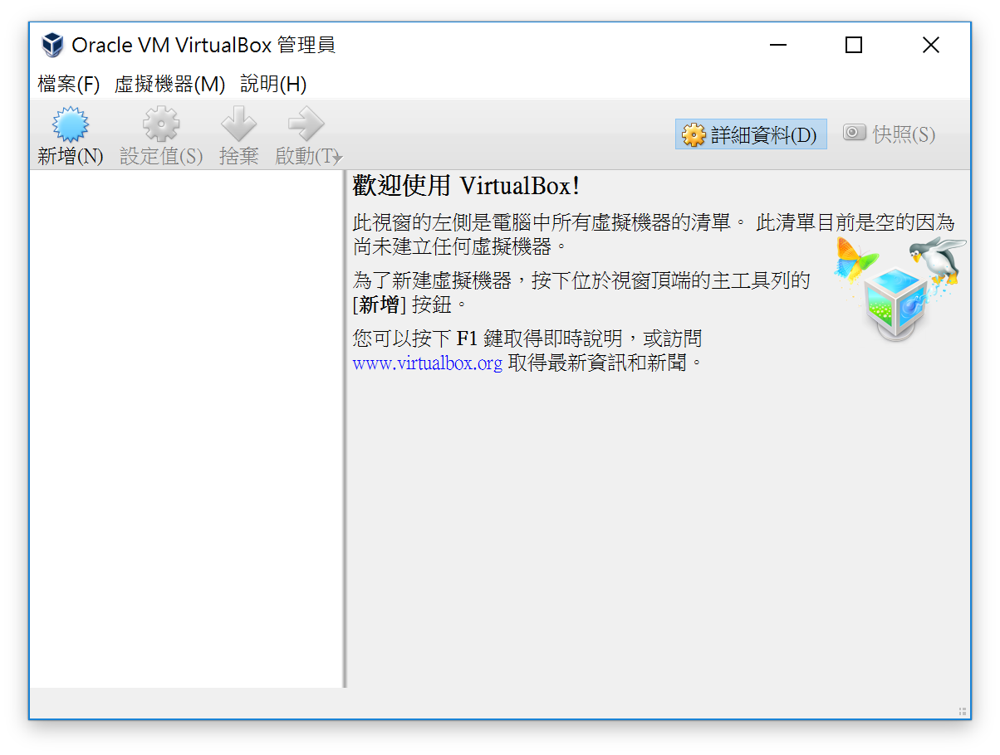

# 安裝 VirtualBox

## 目錄
- [回目錄](../SUMMARY.md)

***

## 安裝步驟

1. 下載 [VirtualBox](https://www.virtualbox.org/)
2.

3.

4.

5.

6.

7.

8.

9.

10.

11. 完成 VirtualBox 的安裝，可以開始匯入 VM 開發環境
[匯入 ova](../install/index.md)

